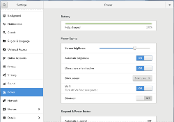
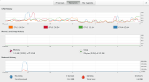

# 6. Environnement de bureau GNOME

Si vous avez fait le choix du bureau GNOME lors de l'installation, vous vous retrouverez, au redémarrage après celle-ci, devant GDM, le gestionnaire de connexion de l'environnement GNOME. Une fois connecté, vous vous retrouverez devant un espace simple et épuré, comprenant le bureau lui-même et la barre supérieure.
Celle-ci vous se compose:
- du menu Activités, tout à fait à gauche, qui vous donne accès à vos applications ainsi qu'à une vue générale des fenêtres ouvertes et des espaces de travail ;
- du centre de notification, au centre : c'est là que vous retrouverez les messages du système et des logiciels (alertes, rappels de calendriers, etc..) ainsi que le calendrier ;
- du menu utilisateur, tout à fait à droite, qui vous permet de gérer le son, la luminosité de l'écran, les connexions réseaux et Bluetooth mais aussi d'accéder à votre compte, aux paramètres du système et d'éteindre la machine.

À l'inverse d'un environnement comme KDE Plasma qui est extrêmement personnalisable, GNOME vise à offrir un espace de travail simple, clair, sans fioritures et qui vous permet de vous consacrer à votre tâche. Il peut toutefois être complété grâce à l'ajout d'extensions (voir ci-dessous).

## 6.1 L'environnement de bureau

Ce bureau vise à offrir à ses utilisateurs une nouvelle métaphore d'environnement de bureau et change donc beaucoup par rapport aux environnements plus traditionnels (souvent composés d'une barre des tâches et d'un menu verticial en bas à gauche).
Certaines choses diffèrent donc considérablement de la plupart des autres environnements de bureau :

- la barre des tâches se trouve en haut et affiche plusieurs sous-menus énumérés ci-dessus ainsi que le menu de l'application **au premier plan** ;
- le bureau lui-même n'est qu'un espace destiné à accueillir les fenêtres, il ne sert à afficher les icônes des applications ou des raccourcis vers vos fichiers ;
- la plupart des raccourcis font appel à la touche Super (injustement représentée par le logo Windows sur la plupart des PC), préssée seule cette touche vous donne accès au *Shell* : c'est là que vous allez retrouver l'ensemble de vos applications ainsi qu'une vue étalée de toutes vos fenêtres ouvertes.

 

### 6.1.1 Le *Shell*

C'est sûrement l'aspect le plus particulier à GNOME. Lorsque vous appuyer sur la touche *Super* ou que vous cliquez sur *Activités* en haut à gauche ou bien que vous envoyez le pointeur de la souris dans ce même coin supérieur droit, GNOME affiche le *Shell* qui se compose de 4 éléments principaux :

- le *Dock*: c'est la barre vertical à gauche qui contient les applications favorites ;
- en haut au centre, il y a l'espace de recherche: dès que vous entrez dans le *Shell*, commencez à taper les premières lettres de votre recherche pour que s'affiche toutes les applications, mais aussi les fichiers, dossiers et logiciels disponibles (mais non installés) dont le nom contient les lettre recherchées. Ainsi taper "Fi" renverra notamment Firefox. Le résultat le plus pertinent est mis en surbrillance, il suffit d'appuyer sur Entrée pour lancer l'application ;
- au centre se trouve la vue en mosaïque des fenêtres existantes dans l'espace de travail actuel ;
- à droite, en vertical, vous trouverez la liste des espaces de travail virtuels.

### 6.1.2 Espace de travail virtuel

Pour éviter que votre bureau ne soit encombré de fenêtres, vous pouvez utiliser des espaces de travail virtuels pour organiser vos applications et être plus productif.
GNOME en crée 2 par défaut, l'actuel plus un « en réserve » puis en crée d'autres au fur et à mesure que vous « peuplez » les espaces de travail virtuels existants.

Vous retrouverez une vue miniature de tous vos espaces de travail dans le *Shell*, sur le côté droit.

## 6.2 Gestion des fichiers

Le gestionnaire de fichiers par défaut est l'application **Fichiers** (du paquet *nautilus*), qui est l'un des favoris dans le Dock. Il devrait être très intuitif. Les clés USB et autres supports amovibles apparaîtront automatiquement dans le volet gauche.

Shell => Recherche "Fichiers"
 

 

## 6.3 Configurer le bureau (Paramètres GNOME)

Les paramètres globaux de GNOME sont regroupés de manière pratique en un seul endroit. Ici, vous pouvez configurer presque tout ce qui concerne votre bureau, y compris le comportement de la souris, les applications par défaut, les imprimantes et réseaux, vos comptes en ligne, etc.

Shell => Paramètres

 

<table>
<tbody>
<tr>
<td></td>
<td>Ne confondez pas le centre de contrôle GNOME utilisé pour la configuration personnelle de l'espace de travail GNOME avec le centre de contrôle YaST utilisé pour les paramètres d'administration de la globalité du système (Voir plus loin le chapitre sur YaST).</td>
</tr>
</tbody>
</table>

 

## 6.4 Moniteur système / Tableau des processus

Naturellement, GNOME dispose également d'un outil pour surveiller les processus en cours d'exécution et l'utilisation des ressources du système. Recherchez simplement *Moniteur* dans le *Shell*.

 

## 6.5 Extensions

L'environnement de bureau GNOME peut être complété par de nombreuses extensions disponibles sur le site [https://extensions.gnome.org](https://extensions.gnome.org). Vous y trouverez des extensions pour tous les usages que ce soit multimédia, notifications, modification du *Shell*, presse-papier etc...

Attention toutefois avec les extensions, elles sont développées pour la plupart par des développeurs amateurs ou bénévoles et ne font pas partie officiellement du projet GNOME. Certaines d'entres elles peuvent altérer la stabilité de votre environnement de bureau. Si vous rencontrez des soucis comme des *crashs* ou des blocages, désactivez les extensions.

